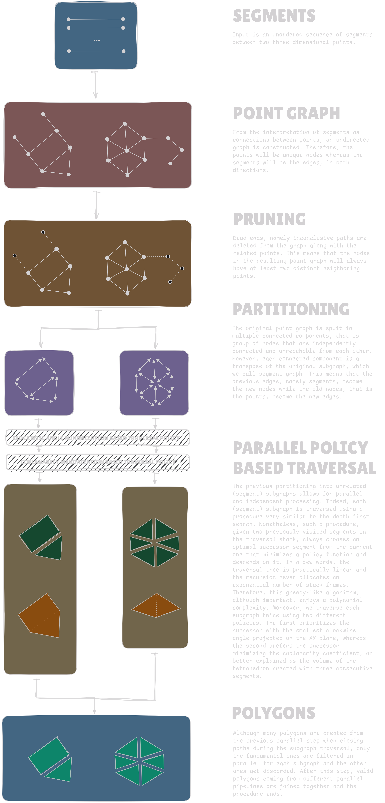

# Polygonum

Polygonum is a Rust-powered library to construct approximately-bidimensional polygons from a set of three dimensional lines.

## Applications

::TODO

## Design

The design of the whole pipeline used by Polygonum to construct a set of polygons from a set of segments is illustrated down below.

## Performance

::TODO

## Dependencies

::TODO
